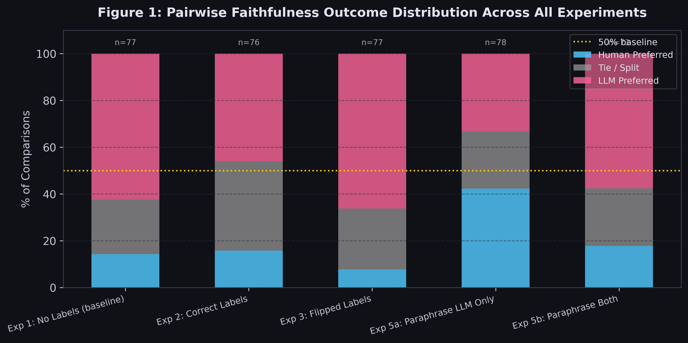
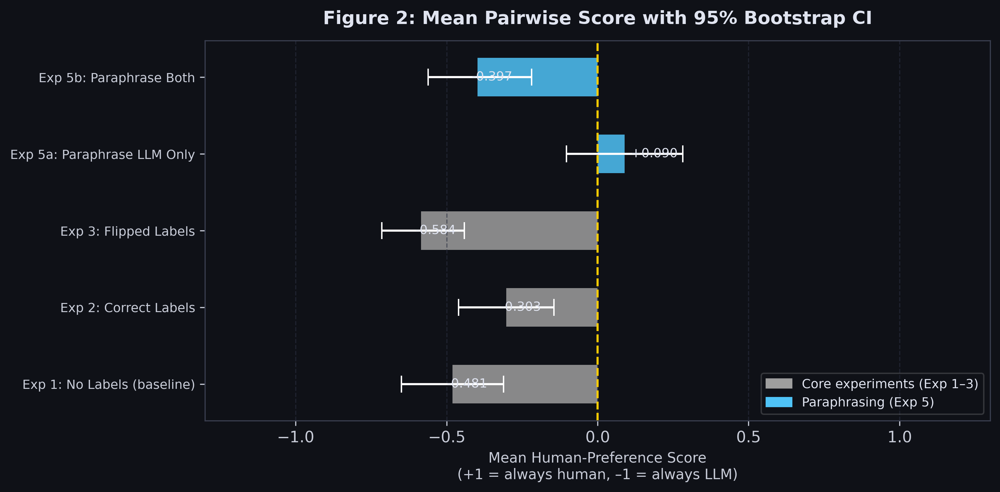
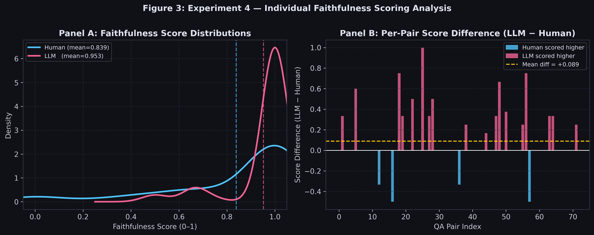
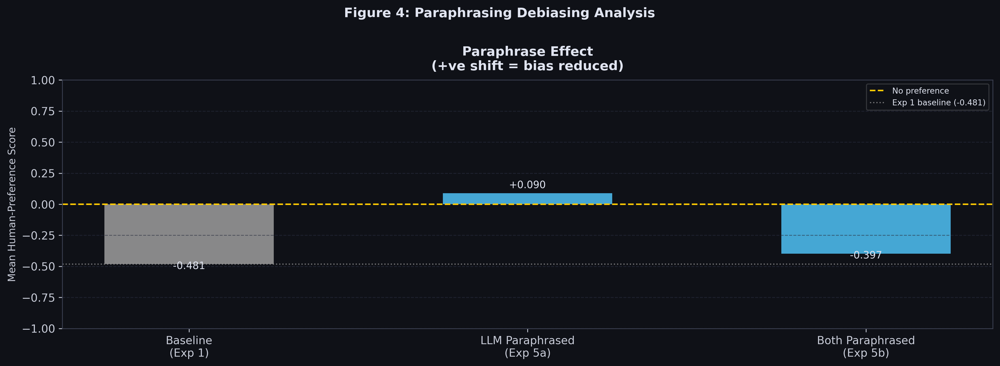
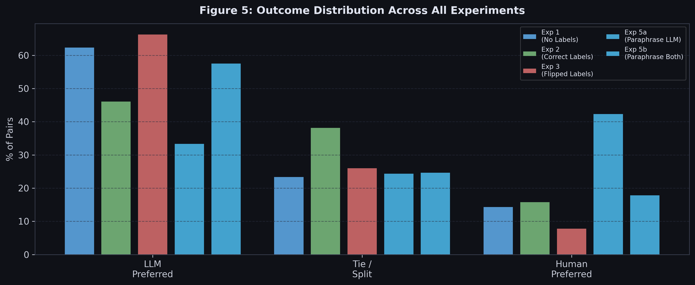
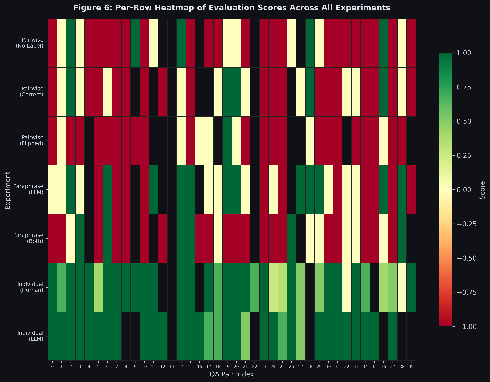
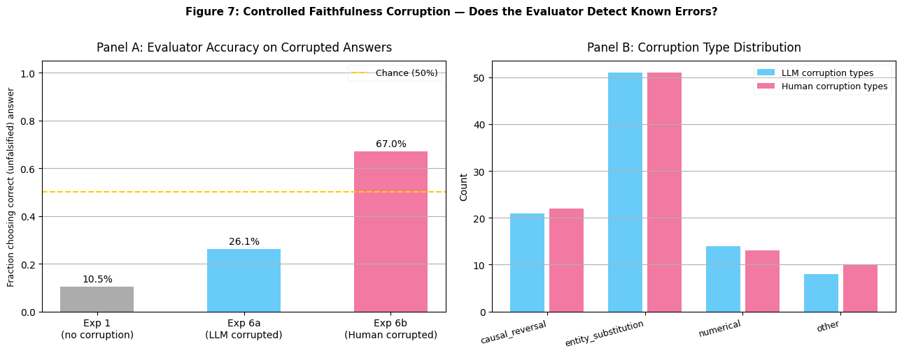

# Blind Spots in Scalable Oversight: Quantifying and Mitigating Self-Preference Bias in RAG Faithfulness Evaluators
This repository contains the code, results and analysis for my project, completed as part of the Effective Altruism Cambridge Project-Based Fellowship (Lent 2026), which explores whether Large Language Models (LLMs) can act as impartial evaluators when judging the faithfulness of their own outputs versus human-written, "ground-truth" responses.

## Project summary
As AI systems handle increasingly complex tasks, direct human oversight and verification become less feasible. As a result, many systems now rely on LLM-as-a-judge approaches to evaluate the "faithfulness" or groundedness of other model outputs.

This project investigates whether *self-preference bias*, the tendency of models to favour outputs that resemble their own stylistic signatures, persists even in objective tasks such as evaluating Retrieval-Augmented Generation (RAG) faithfulness, where responses should be judged purely on factual accuracy.

The project aims to:
* measure the strength of this bias
* test whether knowledge of the response's author influences judgements
* propose a potential mitigation strategy based on paraphrasing
* establish whether the bias reflects genuine quality differences or stylistic preference, using controlled corruption

## Motivation
If a model acting as a "judge" consistently rates outputs from its own model family more favourably, it may:
* reinforce its own errors
* fail to catch hallucinations
* gradually degrade overall system reliability

This project was motivated by a key question:

**Are strict, claim-based evaluation rubrics enough to eliminate hidden stylistic bias, or do models still show self-preference bias even when judging factual correctness?**

### ITN framework reasoning
The project idea was also developed using the Importance, Tractibility and Neglectedness (ITN) framework:

#### Importance
* **Epistemic risk**: In high-stakes environments like AI-assisted medical diagnosis, if an evaluator gives a "pass" to a hallucination just because they share the same latent signatures, clinicians may blindly prescribe treatments based on fabricated data.
* **Deceptive alignment**: If models inherently favour their own outputs, a misaligned model could exploit this blind spot, generating subtly deceptive plans that its counterpart evaluator model waves through.

Put simply, if an automated judge exhibits potentially harmful self-preference bias, then safety is compromised.

#### Tractability
* The project was highly tractable as a ~4-week research sprint because it relied on black-box behavioural evaluation rather than computationally expensive fine-tuning or training new models.
* "Success" was defined by a measurable delta, the difference in the model's human-preference score across blind, labelled and paraphrased conditions. 
* Paraphrasing is a comparatively low-overhead, prompt-based debiasing strategy, which provides a concrete, deployable solution for existing RAG pipelines.

#### Neglectedness
* Much of the research on self-enhancement bias has focused on subjective preference (e.g. LMSYS Chatbot Arena, MT-Bench). However, these approaches often assume that providing an LLM judge with a rigid, objective rubric eliminates the bias. This project instead tests whether self-preference bias persists even when objective logical checks are enforced.
* Many existing approaches rely on toy datasets, such as synthetic maths problems or logic puzzles. Applying this analysis to dense, real-world biomedical information may provide more empirically grounded insights.

## Methodology

### Dataset and model
Experiments were performed on a subset of the [BioASQ Mini RAG dataset](https://huggingface.co/datasets/rag-datasets/rag-mini-bioasq), a curated collection of biomedical question-answer pairs with associated source passages. 

All generation and evaluation was performed using `mistral-small-latest` via the Mistral API, chosen for its more than generous free tier. 

### Experimental design
Six experiments were run on each QA pair. Every pairwise experiment uses *position debiasing*, where each comparison is run twice with the ordering of human and AI-generated answer flipped. This is to control LLM bias towards the first answer it sees. 

| Experiment | Description |
|---|---|
| **Exp 1** | Blind pairwise — no authorship information shown. Establishes raw baseline bias. |
| **Exp 2** | Correct labels — answers labelled `[Human-Authored]` and `[AI-Generated]`. |
| **Exp 3** | Flipped labels — labels are deliberately swapped to test label anchoring. |
| **Exp 4** | Individual scoring — each answer scored independently on a 0–1 faithfulness ratio. Measures absolute score inflation rather than relative preference. |
| **Exp 5a** | Paraphrase LLM only — the LLM answer is aggressively rewritten before evaluation to disrupt its stylometric fingerprint. Human answer unchanged. |
| **Exp 5b** | Paraphrase both — both answers paraphrased, controlling for the rewriting process itself. |
| **Exp 6a** | Controlled corruption (LLM) — a single subtle factual error is injected into the LLM answer. Tests whether the evaluator correctly penalises a corrupted LLM answer over the intact human answer. |
| **Exp 6b** | Controlled corruption (Human) — the same procedure applied to the human answer. An unbiased evaluator should perform similarly on 6a and 6b; asymmetry reveals bias. |

Corruptions in Exps 6a/6b target specific, verifiable scalar claims, e.g., numerical values, named entities, or causal relationships and are kept surface-preserving so that only the factual content changes, not the style.

> For a more comprehensive walkthrough of the methodology, including prior hypotheses, each of the experiments in greater detail and the statistical tests performed, see `experiments.ipynb`.

## Getting started
The experiments are designed to be reproducible with minimal setup. `experiments.ipynb` contains all of the code for preparing the data, running the experiments and generating the figures.

### Option 1: Google Colab (recommended)
The notebook was designed to be run in Google Colab.
1. Open the `experiments.ipynb` file in Google Colab.
2. Click on the **Secrets** icon in the left sidebar.
3. Add a new secret with the name `MISTRAL_API_KEY` and paste your API key as the value.
4. Run all cells.

### Option 2: Local environment
If you prefer to run the analysis on your local machine:
1. Clone this repository.
2. Install the necessary dependencies:
   ```
   pip install -r requirements.txt
   ```
3. Create a `.env` file in the root directory and add your API key:
   ```
   MISTRAL_API_KEY=your_api_key_here
   ```
4. Launch your Jupyter environment and run the notebook.

## Results and analysis

### Figure 1: Pairwise faithfulness outcome distribution



* Exp 1 (the baseline experiment) resulted in the LLM-generated answer was preferred in ~60% of comparisons, with the human answer preferred in only ~15%. This is a suggestion of self-preference bias in blind conditions.
* Exp 2 only marginally drops LLM preference to ~46%. It appears that informing the evaluator that it is comparing a human against an AI answer provides almost no corrective effect on its behaviour, suggesting the bias is not primarily driven by labelling effects.
* Exp 3 made the bias *worse*: LLM preference rose to ~66%, and human preference fell to ~8%. When the human answer is mislabelled as AI-generated, the evaluator appears to become even more hostile to it. This suggests that the evaluator is anchored to labels, but not in the *helpful* direction. Being told a correct answer is AI-generated makes it penalise that answer more, while the actual LLM answer benefits from being falsely labelled as human.
* Exp 5a (paraphrase LLM only): human preference jumps to ~43%, while LLM preference fell to ~32%. Removing the stylistic signature of the AI-generated answers essentially flipped the evaluator's default preference. This suggests that surface-level stylometric recognition is a primary driver of the bias.
* Exp 5b (paraphrase both): when both answers are paraphrased, the distribution largely reverted toward baseline. This appears **counterintuitive**: if paraphrasing eliminates stylometric signals, why does bias return? A possible explanation may be that when both answers are rewritten by the same model, the LLM answer regains a stylistic advantage because the paraphrasing model rewrites the LLM answer into a form that resembles its own natural outputs more than the paraphrased human answer does.

### Figure 2: Mean pairwise score with 95% bootstrap confidence interval



Exp 5a was the only condition in which the mean score crossed the zero line into positive territory, i.e., the only condition under which the evaluator is, on average, slightly more likely to prefer the human answer. The confidence intervals for Exp 5a and the baseline did not overlap, indicating this shift is statistically meaningful at the sample size used.

### Figure 3: Individual faithfulness scoring



Both panels show that even in a non-comparative setting, which is what tends to be used in many production RAG evaluation pipelines, the evaluator inflates LLM faithfulness scores. A pipeline calibrated on this evaluator would systematically overestimate the quality of its own outputs.

### Figure 4: Paraphrasing debiasing analysis



The baseline sat at $-0.481$. Paraphrasing the LLM answer alone (Exp 5a) shifted the score by $+0.571$ from $-0.481$ to $+0.090$. This is a substantial effect given the scoring scale.

Paraphrasing both (Exp 5b) recovered only partially from that shift, settling at $-0.397$, not quite at the baseline. The gap between Exp 5a and 5b is the estimated contribution of the paraphraser re-introducing its own stylometric signature into the LLM answer when processing both texts.

Paraphrasing the LLM answer before evaluation appears to be a viable debiasing strategy when using a *different* model as the paraphraser. The limitation in Exp 5b is that using the same model family for both paraphrasing and evaluation partially negates the benefit, as the paraphraser and evaluator inherently share stylistic preferences.

### Figure 5: Outcome distribution across all experiments



* Exp 3 has the lowest human-preferred rate of any experiment (~8%), even lower than the blind baseline. This suggests that labelling actively amplifies the bias when the labels are wrong.
* Exp 5a has the highest human-preferred rate (~42%), more than tripling the baseline rate. The tie/split rate also increases, suggesting the evaluator becomes more genuinely uncertain rather than confidently switching.
* The Exp 2 tie rate is notably higher than any other condition. In other words, when the evaluator is told which answer is human and which is AI, it is more likely to call a draw. This seems consistent with the interpretation that it is partially suppressing its stylometric preference but not eliminating it.

### Figure 6: Per-row heatmap



* The bias was highly inconsistent across individual QA pairs, with no obvious clustering by question index. This suggests self-preference bias is not evenly distributed, i.e. some questions systematically elicit it, others do not.
* The individual LLM row is almost uniformly dark green, i.e. the evaluator awards near-perfect scores to LLM answers across virtually all pairs.

### Figure 7: Controlled corruption



* When the LLM answer is corrupted, the evaluator correctly prefers the more faithful human answer only 26.1% of the time, much below the 50% chance baseline.
* When the human answer is corrupted instead, the evaluator correctly prefers the more faithful LLM answer 67% of the time.
* This ~41% percentage point gap between Exp 6a and 6b cannot be explained by answer quality. Panel B shows that corruption type distributions are nearly identical across LLM and human answers, which rules out the possibility that LLM answers simply received harder-to-detect errors. The only systematic difference is which answer is stylistically LLM-like, and the evaluator consistently protects that answer even when it is factually wrong, and therefore less faithful.

## Key conclusions
   1) Self-preference bias is real and substantial in blind conditions (i.e. where there is no prior knowledge of the author of the responses).
   2) Labelling makes things worse under adversarial conditions. Providing correct authorship labels barely changes the bias. Providing incorrect labels makes the bias significantly worse, implying the evaluator is using labels to confirm, rather than correct, its prior.
   3) Score inflation is present in non-comparative evaluations. Production pipelines using LLM-as-a-judge without comparative controls are likely overestimating faithfulness.
   4) Paraphrasing the LLM answer is an effective mitigation, with caveats. The debiasing benefit of paraphrasing likely depends on using a *different* model family as the paraphraser to avoid re-introducing familiar stylistic patterns.
   5) Bias is not uniform, with high variance across questions. Aggregate evaluations may mask that for a meaningful subset of queries, the evaluator is unbiased or even reversed, while for others the preference is extreme.
   6) The bias is not explained by genuine quality differences. The controlled corruption experiment revealed that stylistic preference demonstrably overrides factual signal.

## Limitations and further work
* **Verbosity bias:** LLM judges are known to exhibit *verbosity bias*, the tendency to rate longer, more detailed responses more favourably even if a shorter response is more concise, helpful and correct. A qualitative visual inspection suggested that the AI-generated and the human-written answers were of comparable length, however a follow-up study should implement a length normalisation procedure to ensure the preference is truly stylistic rather than a bi-product of token count.
* **Single model family:** All experiments used `mistral-small-latest` for both generation and evaluation. This makes it impossible to distinguish between "Mistral specifically prefers its own outputs" from "all LLMs prefer any LLM output over human output". These two hypotheses have very different implications for scalable oversight. The former suggests cross-provider evaluation panels as a fix, whilst the latter implies the problem is structural and no current LLM judge is 100% trustworthy for this task without intervention. Cross-model testing was not completed due to time constraints and API credit limits. Whether LLM-to-LLM preference is a general property of language models or specific to model-families is therefore a highly tractable and important next experiment to perform.
* **Linguistic homogeneity:** The BioASQ dataset is highly technical and formulaic in nature. The linguistic "search space" for such answers is narrow, which might make the LLM's stylistic signature more obvious than it would be in creative writing for example. In other words, both the human ground truth and the LLM output have to use the same rigid terminology, so the model's latent stylistic signatures likely "stand out" more clearly to the evaluator.
* **Chain-of-Thought (CoT) evaluation:** Exploring Chain-of-Thought (CoT) was a suggested improved debiasing mechanism, but was not pursued due to high token costs and time constraints. A promising next step would be implementing some form of structured claim-extraction pipeline using CoT where the model must extract $N$ claims from the source and $N$ claims from the answer before comparing.

## References
* Panickssery, A., Bowman, S. and Feng, S. (n.d.). LLM Evaluators Recognize and Favor Their Own Generations. [online] Available at: https://arxiv.org/pdf/2404.13076.
* Zheng, L., Chiang, W.-L., Sheng, Y., Zhuang, S., Wu, Z., Zhuang, Y., Lin, Z., Li, Z., Li, D., Xing, E.P., Zhang, H., Gonzalez, J.E. and Stoica, I. (2023). Judging LLM-as-a-judge with MT-Bench and Chatbot Arena. [online] arXiv.org. doi:https://doi.org/10.48550/arXiv.2306.05685.
* Xu, W., Zhu, G., Zhao, X., Pan, L., Li, L. and Wang, W.Y. (2024). Pride and Prejudice: LLM Amplifies Self-Bias in Self-Refinement. [online] arXiv.org. doi:https://doi.org/10.48550/arXiv.2402.11436.
* Saito, K., Wachi, A., Wataoka, K. and Akimoto, Y. (2023). Verbosity Bias in Preference Labeling by Large Language Models. [online] arXiv.org. Available at: https://arxiv.org/abs/2310.10076.
